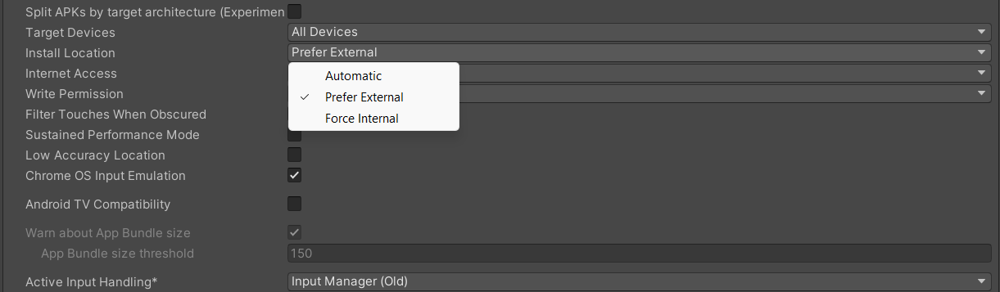

# Configuracion

## Importación de XR a Unity

Guía de instrucciones: Configuración de Unity para el desarrollo de Oculus Quest

 

* Open Unity and click on File > Build Settings

 

 

 
 

* Change the platform to Android

* Follow the link provided and use the Build settings suggested by Oculus for Unity

* Change the Texture Compression to ASTC

* Open Player Settings

 

 

 
 

* Click on the "XR Plugin Management" button at the bottom left

 

 
 

* Click "Install" for Unity's new XR plugin system

 

 

 
 

* Check the Oculus toggle under the Plugin-in providers for Android

* Click on the Oculus toggle and keep all default settings

 

 

 

 

 
 

* You can see that this Plug in can be built for both quest and quest 2

 

 

 
 

* Under Player settings, enter your unique company name for "Company Name"

* Follow Unity's suggestions for other settings

 

 

 
 

* Choose "Linear" for Color Space

 

 

 
 

* Ensure that OPENGLES3 is the only Graphics API in Graphics APIs

* Check the "Default package name" toggle and enter your unique package

 

 

 
 

* Set the Minimum API Level to min 23 Android 6.0 Marshmallow

* Set the Target API Level to Automatic (Highest Installed)

* Set the Install Location to Automatic

 

 

 
 

* Check "Multi-threaded Rendering"

* Under Active Input Handling, select "Both"

 

 

 

 
 

* Go to the "Quality" tab under project settings

* Create a new Quality level for Oculus Quest named "Quest"

* Uncheck all the other settings

* Enable the Quest setting for the Android platform

* For PC, go with Ultra

* Set the Pixel Light Count to 1

* Disable Soft Particles

* Select "Per Texture" for Anisotropic Textures

* Select "4x" for Anti Aliasing

* Be sure that "Realtime Reflection Probes" and "Billboards Face Camera" are selected

* Follow the link provided and import Unity's XR Interaction Toolkit

 

 

 
 

* Go to File > Project Settings

* Choose "Package Manager" and enable "Preview Packages"

 

 

 

 
 

* Click on Window > Package Manager

* Choose "Unity Registry"

* Under "XR Interaction Toolkit", click on "Install"

* Check the warning about the new input system from Unity, if you get one

 

 

 

 

 
 

Congratulations, your Unity project is now configured for Oculus Quest development!

 
 
 

## Instructions for Setting up XR Rig for Unity:

 

* Add xr origin to heirarchy 

 

 

 
 

* Create a plane and add texture

 

 

 
 

* In the XR Rig script, set the "Tracking Origin Mode" field as "Floor"

 

 

 
 

* Expand the XR Rig and you will see Camera offset, Left and Right Hand controllers

 

 

 
 

* To set up the XR Rig for the new input system, go to Assets > Samples > XRI Toolkit > X.X.X  > Default Input Actions

 

 

 
 

* Click on "XRI Default Left Controller" and click on "Add to ActionBasedController Default"

* Do the same for the "XRI Default Right Controller"

 

 

 

 
 

* Go to Edit > Project Settings and go to Preset Manager

* Rename "Left" to "LeftHandController" and "Right" to "RightHandController"

 

 

 
 

* Delete the XR Rig and add it again

* Make sure to reset its transform

* Check that the hand controllers use the correct references, such as LeftHandController using "Left" and RightHandController using "Right" action references

 

 

 

 
 

* Create two cubes as hands

 

 

 
 

* Now, you are ready to view Unity

 
 
 

## Ver escena construida en VR

To view the new VR scene on your Oculus headset using either Oculus Link or SideQuest, you can follow these steps:

 
 
 

### Using Oculus Link:

* Make sure your Oculus Quest is connected to your PC with a USB-C cable and that you have enabled Oculus Link mode on your headset.

* Open the Oculus PC app on your computer and click on the Devices tab.

* Make sure your Oculus Quest is connected and that it shows up under the Devices tab.

* Launch the VR scene you created in Unity and click on File > Build Settings.

* Select the platform as PC, then click on Build and Run.

* After the scene is built, the Oculus Link window should appear on your PC. Put on your Oculus Quest headset and select the Oculus Link option in the Quest menu.

* Your VR scene should now be visible on your Oculus Quest and you can navigate through it using the controllers.

 
 
 

### Using SideQuest:

* Connect your Oculus Quest to your PC with a USB-C cable.

* Open SideQuest on your computer and make sure your Oculus Quest is recognized by the app.

* Click on the Install APK button in SideQuest and select the APK file you want to install.

* Wait for the installation to complete and then disconnect your Oculus Quest from your PC.

* Put on your Oculus Quest headset and navigate to the Unknown Sources section of the library.

* Select the app you just installed and it should launch the VR scene you created in Unity.

* Congratulations! You have now successfully viewed your new VR scene on your Oculus headset using either Oculus Link or SideQuest.
