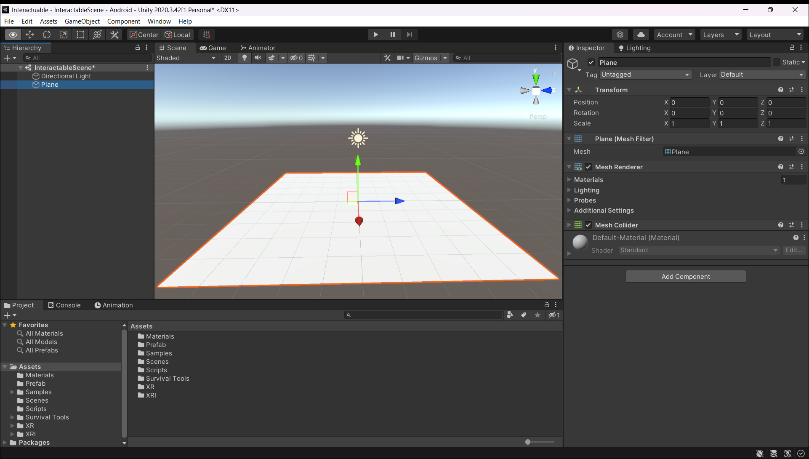

# Interactuables

## Comienza con la interacción

 
 

* Agrega un plano a la escena y asegúrate de que los “gizmos” estén habilitados
 

 
 

* Configura el espacio del jugador para que sea un área de 6 metros por 6 metros donde el jugador se puede generar (spawnear)
* Configure el modo de seguimiento en “XR Origin” a “Floor”
 

 
 

* Crea un cubo y cámbiale el nombre a "Table". Arrástralo hacia la dirección de la cámara delantera
* La flecha azul es la dirección delantera del juego.
* Agrega un componente “Rigid Body” a esta tabla
 

 
 

* Crea una carpeta "Material" en la carpeta "Asssets" y crea un material para la mesa con el color que prefieras. Adjunta este material arrastrando y soltando en el objeto “Table”
 

 
 

* Ve al “Unity Asset Store” y descarga el <a href="https://assetstore.unity.com/packages/3d/props/tools/survival-game-tools-139872" target="_blank">"Survival Game Tools"</a> asset

 

 
 

* Descarga el asset, luego importa el paquete descargado a tu proyecto de Unity
 

 
 

* En la pestaña "Project" de la "Scene View", ve a "Prefabs" y arrastre el kit médico prefabricado a la vista de escena. Seleccione el prefabricado y agregue un componente “Mesh Collider” y “Rigid Body”. Asegúrate de cambiar el modo de detección de colisión del cuerpo rígido a "Continuous Speculative"
 

 
 

* Para configurar el controlador manual predeterminado, elimina todos los componentes conectados al controlador manual derecho en un orden específico.
Agrega los siguientes componentes: “XR Controller Action Based”, “XR Direct Interactor” y “Sphere Collider”. Cambia el tamaño del colisionador de esferas según sea necesario.

* El componente “XR Ray Interactor” en el “XR Rig” de la mano izquierda y derecha está preestablecido con un” ray interactor” que dispara un rayo desde la mano y verifica si puede interactuar con cualquier cosa que golpee el rayo. Si el objeto puede interactuar eso traerá el objeto a la mano.

 

 
 

* También se puede utilizar un interactor directo, que es un objeto de colisión de esferas. Si hay un colisionador, será recogido. Solo puede elegir uno, pero existe una forma posible de convertirlo en un objeto principal si es necesario. El “XR Ray Interactor” puede funcionar con interfaz de usuario y teletransportación. Tiene una línea visual de interacción preestablecida que se vuelve roja y blanca dependiendo en lo que puede recoger o no.

 

 
 

* Agrega el componente interactivo “XR Grab” a los objetos con los que deseas interactuar. Esto contendrá los datos de cualquier cosa con la que se pueda interactuar.
 

 
 

* Usa “Layer Mask” para elegir con qué colisionador interactuar si hay muchos colisionadores en un objeto.
Puedes configurar una retícula personalizada para cuando se desplaza o interactúa con un objeto. Este es un “sprite” 2D que se asigna a la superficie del objeto.
 

 
 

* Para el colisionador de esferas de la derecha, marca “IsTrigger” para permitir que pase y tenga una interacción de activación
 

 
 

* Asegúrate de desmarcar “Anchor Control” para el Interactor de rayos XR de mano izquierda y derecha al caminar y sostener un objeto
 

 
 

* Para el tipo de movimiento en” XR Grab Interactable”, elije entre espacio físico, seguimiento de velocidad, teletransportación cinemática o instantánea según el efecto que desees.
 

 
 
 

## Guía paso a paso para comprender “XR Grab Interactable”

 

### Tipo de movimiento (Movement Type)
Esto te permite elegir cómo se debe mover el interactivo cuando se levanta. Las opciones son: cinemática (Kinematic), seguimiento de velocidad (Velocity Tracking) y teletransporte instantáneo (Instatanius Teleport)

 
 

### Administrador de interacciones (Interaction Manager)
Esto te permite especificar qué administrador de interacción debe usar el interactivo. Esto es útil si tiene múltiples administradores de interacción en tu escena

 
 

### Máscara de capa de interacción (Interaction Layer Mask)
Esto te permite elegir con qué capas puede interactuar el interactivo. Por ejemplo, si tienes un arma que no debería poder interactuar con otras armas, puede usar esto para restringir la interacción solo a ciertas capas.
Selección del tipo de interactuador: esto te permite elegir qué tipo de interactuador se usará para seleccionar el interactuable. Las opciones son: Ray Interactor, Direct Interactor e Hybrid Interactor

 
 

### Retícula personalizada
Esto te permite especificar una retícula personalizada para el interactuable. Por ejemplo, si tienes un arma, puedes usar una retícula en forma de cruz que aparece cuando el jugador apunta

 
 

### On First Hover Enter
Estote permite especificar un evento de Unity que se activará cuando el jugador se desplace por primera vez sobre un elemento interactuable.

 
 

### Tirar (Throw)
Esto te permite especificar la configuración de tiro para el interactuable. Puedes ajustar cosas como la fuerza de lanzamiento, la dirección del lanzamiento y la cantidad de aleatoriedad.

 
 

### Adjuntar transformación (Attach Transform)
Esto te permite especificar una transformación a la que se ajustará el interactivo cuando se recoja. Por ejemplo, si tienes una herramienta que debe ajustarse a la mano del jugador cuando se levanta, puede usarse para especificar la transformación de la mano.

 
 
 

### On Last Hover Exit
Esto te permite especificar un evento de Unity que se activará cuando el jugador deje de pasar el mouse sobre el elemento interactuable.

### Al seleccionar ingresado (On Select Entered)
Esto te permite especificar un evento de Unity que se activará cuando el jugador seleccione el elemento interactuable.

### Al seleccionar Salir (On Select Exited)
Esto te permite especificar un evento de Unity que se activará cuando el jugador anule la selección de la interacción.

### Al activar (On activate)
Esto te permite especificar un evento de Unity que se activará cuando se active el interactivo.

 
 
 

## Descripción general

“XR Grab Interactable” en “Unity XR Toolkit” te brinda mucha flexibilidad cuando se trata de especificar cómo se comportarán los objetos interactuables en tu escena. Al comprender cada una de las diferentes opciones disponibles, puedes crear interacciones complejas que se sientan naturales e intuitivas para el jugador.
