# Unity

## ¿Qué es Unity?

 
 

* Unity es un popular motor de juego que se utiliza para crear videojuegos, simulaciones y experiencias de realidad virtual. Proporciona un poderoso conjunto de herramientas para desarrollar e implementar aplicaciones de realidad virtual inmersivas en múltiples plataformas. Con Unity, los desarrolladores pueden crear entornos, personajes e interacciones realistas utilizando una amplia gama de activos preconstruidos, herramientas de secuencias de comandos y editores visuales. Además, Unity ofrece una amplia compatibilidad con el hardware de realidad virtual, lo que facilita a los desarrolladores la creación y prueba de aplicaciones de realidad virtual en una variedad de dispositivos. En general, Unity es una herramienta esencial para crear experiencias de realidad virtual atractivas y de alta calidad

 
 

## Cómo descargar Unity

 
 

* Ve al sitio web de <a href="https://unity.com/es" target="_blank">Unity</a>
* Haz click en el boton azul "COMENCEMOS" que esta en la esquina superior derecha del sitio web

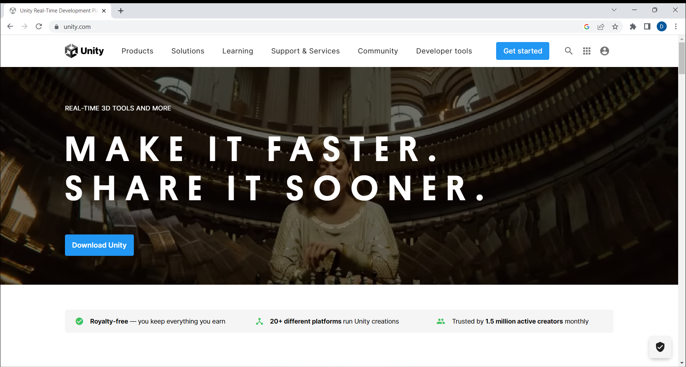 

 

* Encuentra la opcion "Unity Personal Plan" y luego presiona "Start creating with Unity"

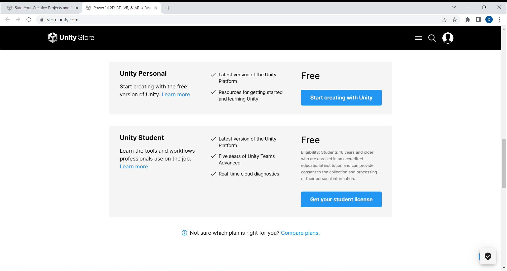 

 

* Haz click en el botón "Dowload for Free"

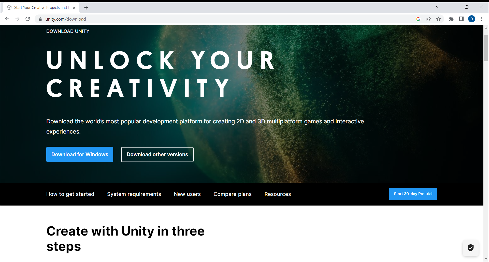 

 

* En la opcion 1 "Dowload the Unity Hub" presione la opcion "Dowload xxxxxxxx" correspondeiente a tu sistema operativo

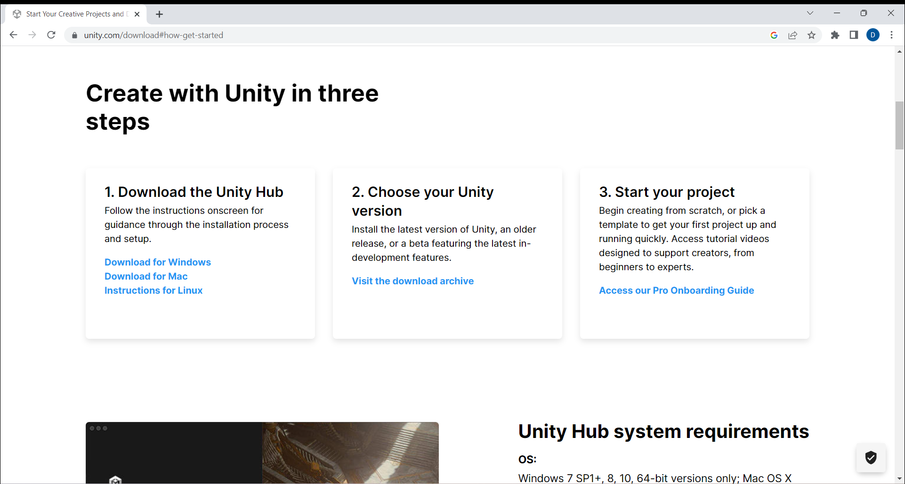 

 

* Una vez que se haya descargado el instalador de Unity Hub, ejecútelo y siga las instrucciones para instalar Unity Hub en su computadora

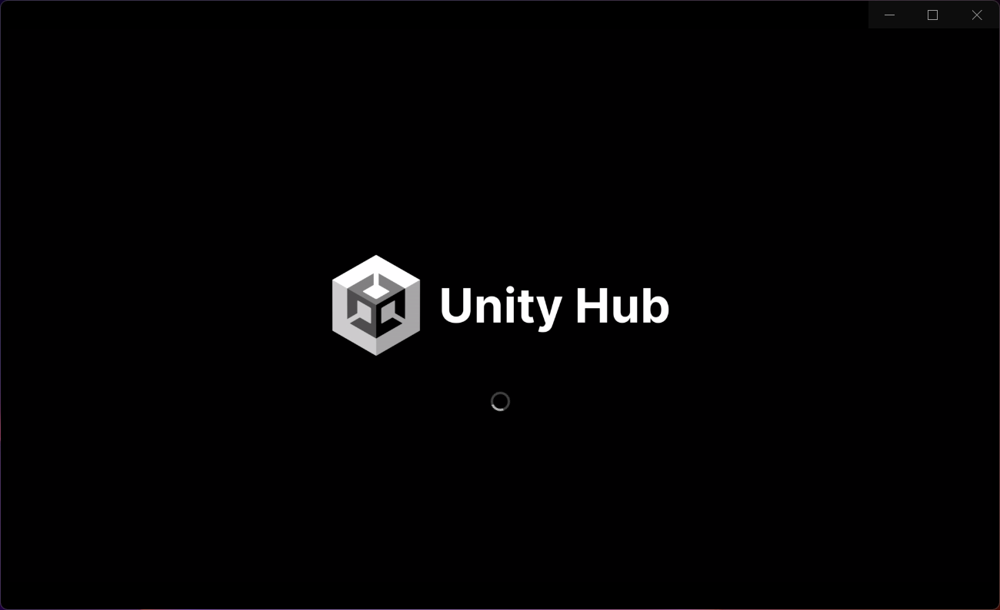 

 

* Una vez que se complete el proceso de instalación, inicie Unity Hub
* Inicia session o crea una cuenta en Unity
* En la ventana de Unity Hub, haga click en la pestaña "Installs" ubicada en el lado izquierdo de la ventana

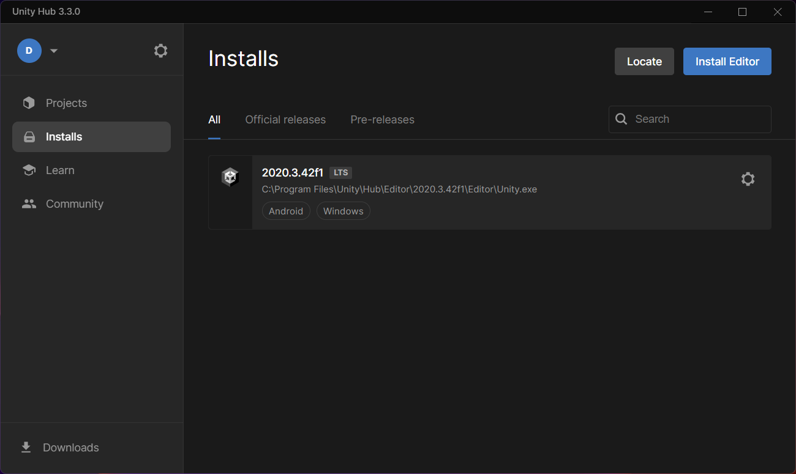 

 

* Haz click en el botón "Install Editor" ubicado en la esquina superior derecha de la ventana

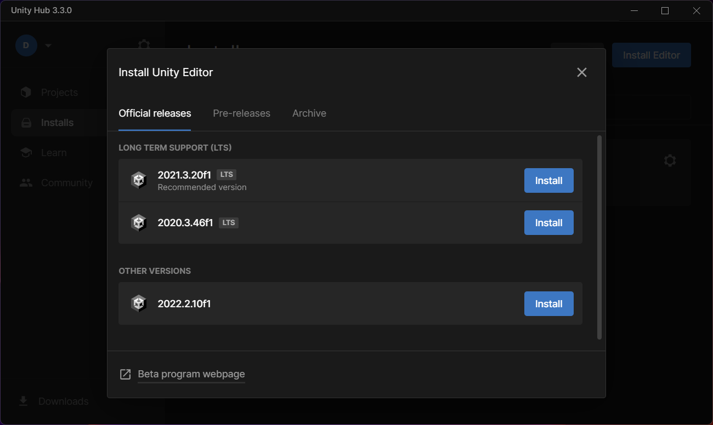 

 

* Selecciona la versión de Unity que desea instalar haciendo click en la opción "Unity 2020 LTS"
* Selecciona la opción "Android Build Support" haciendo click en la casilla de verificación junto a ella

 

 

* Haz click en el botón "Siguiente" y sigue las indicaciones para completar el proceso de instalación

* Una vez que se complete el proceso de instalación, regresa a la ventana de Unity Hub y haz click en la pestaña "Proyectos" ubicada en el lado izquierdo de la ventana

* Haz click en el botón "New" ubicado en la esquina superior derecha de la ventana

* Selecciona la opción "3D" o "2D", según tu preferencia, y elije un nombre y una ubicación para tu nuevo proyecto

* Haz click en el botón "Create Project" para crear el nuevo proyecto

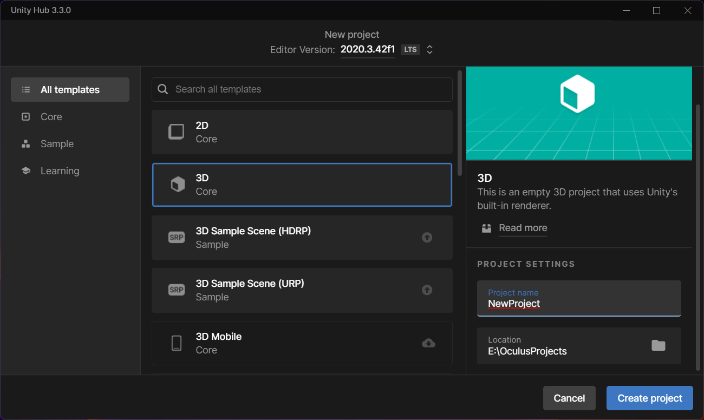

 
 
 

## Cómo usar el Editor de Unity

 
 

### Descripción general
* Unity Editor es un potente entorno de desarrollo integrado (IDE) que permite a los desarrolladores de juegos crear, diseñar e implementar juegos en múltiples plataformas, incluidas las plataformas VR (realidad virtual). Aquí hay una descripción detallada de los conceptos básicos y las características de Unity Editor, con un enfoque particular en el desarrollo de VR.

 

### La interfaz de Unity

La interfaz de Unity es el espacio de trabajo principal donde puede acceder a todas las herramientas y funciones del editor. La interfaz consta de varias ventanas, incluidas Vista de Escena, Vista de Juego, Jerarquía, Inspector, Proyecto y Consola (Scene View, Game View, Hierarchy, Inspector, Project, and Console) . Estas ventanas se pueden reorganizar y personalizar para satisfacer tus necesidades.

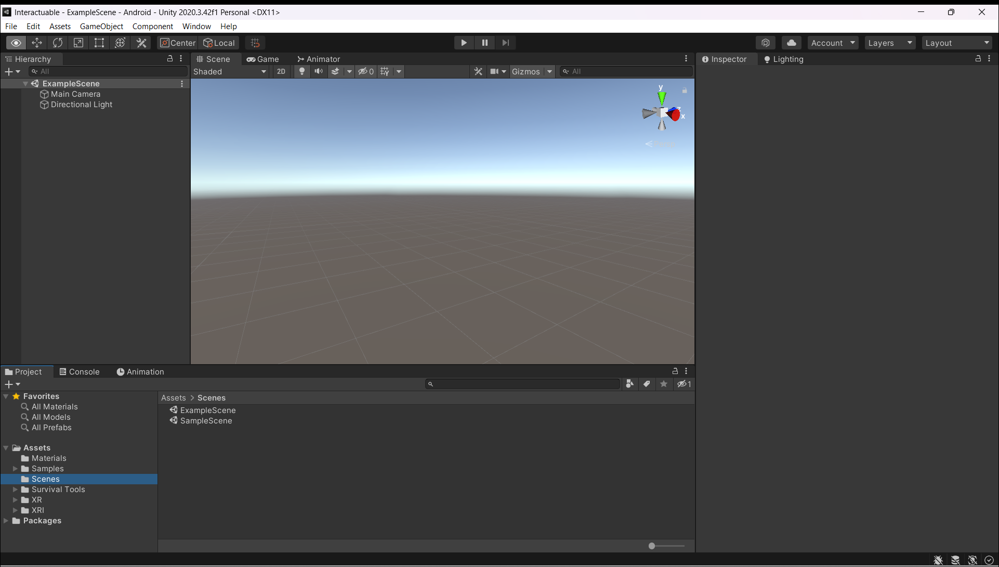

 

### Escenas (Scenes)

Una escena en Unity es un conjunto de objetos de juego, luces, cámaras y otros componentes que conforman un nivel o área de tu juego. Puede crear y administrar múltiples escenas dentro de un solo proyecto.

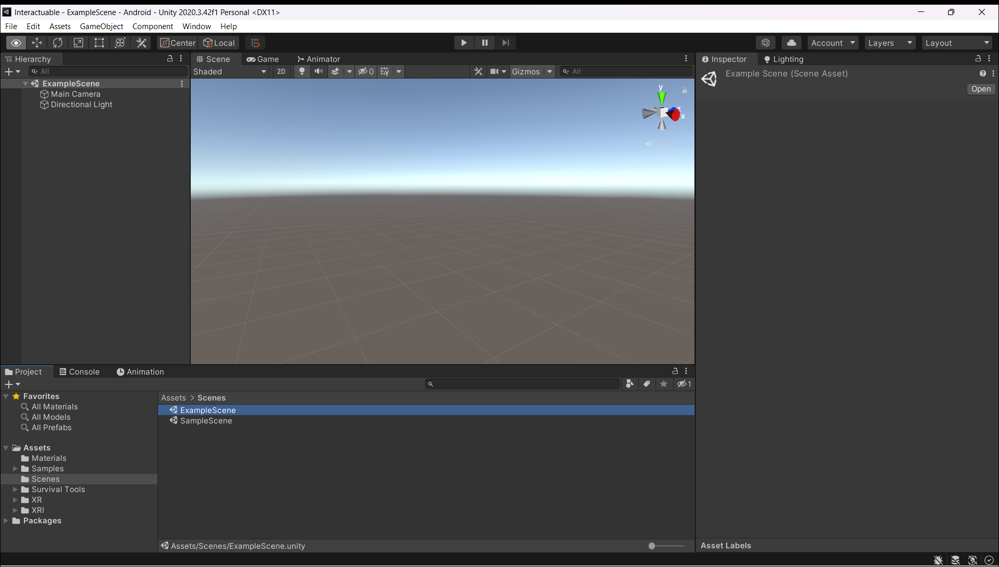

 

### Objetos del juego (Game Objects)

Un objeto de juego es la unidad básica de una escena en Unity. Representa cualquier objeto en tu juego, como un personaje, un arma o un recurso ambiental. Los objetos del juego se pueden personalizar agregando componentes, como colisiones, scripts y sistemas de partículas.

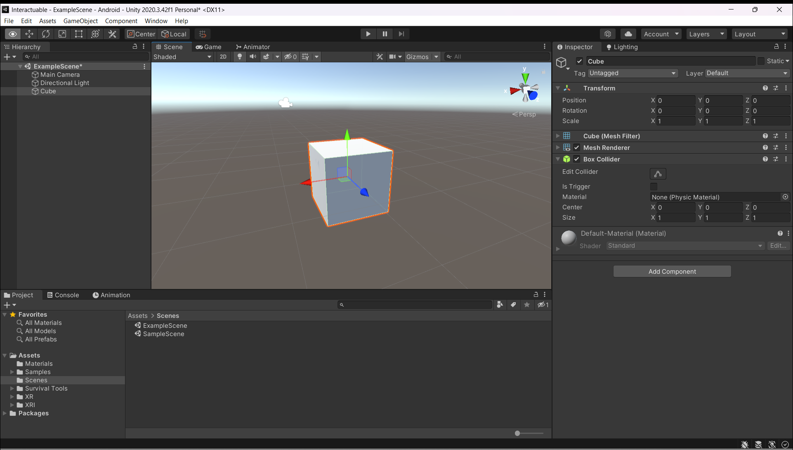

 

### Componentes

Los componentes son partes de código reutilizables que puedes agregar a los objetos del juego para añadir una funcionalidad. Algunos ejemplos de componentes incluyen Rigidbody, Collider, Audio Source y VR Camera. Los componentes se pueden crear y personalizar usando C#.

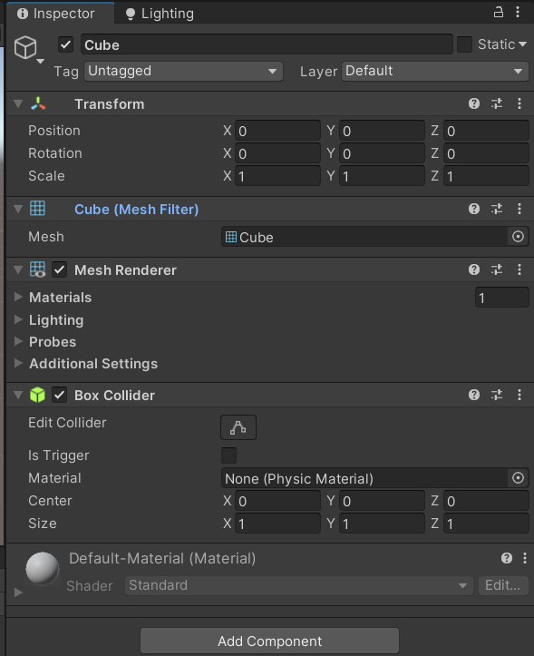

 

### Scripts

Los scripts están escritos en C# y proporcionan la lógica y el comportamiento de los objetos del juego. Los scripts se pueden agregar a los objetos del juego como componentes y pueden interactuar con otros componentes y objetos en la escena.

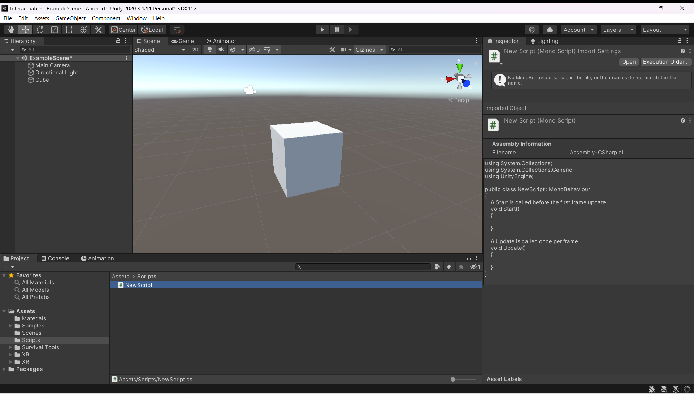

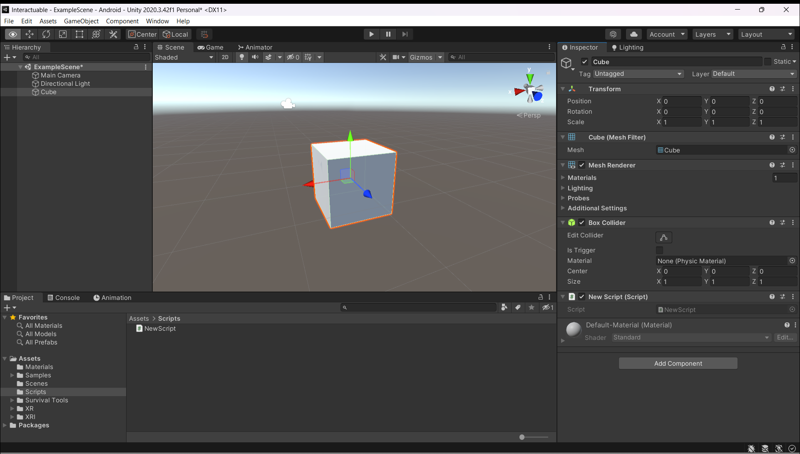

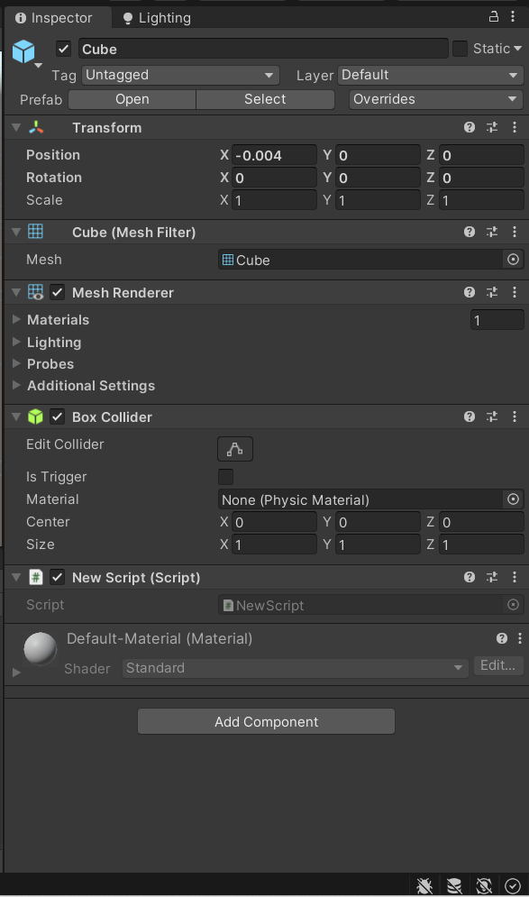

 

### Objetos Prefabricados (Prefabs)

Un Prefabs es un objeto de juego reutilizable que se puede utilizar varias veces en una o en diferentes escenas. Los Prefabs se pueden crear seleccionando un objeto del juego y arrastrándolo a la ventana del proyecto.

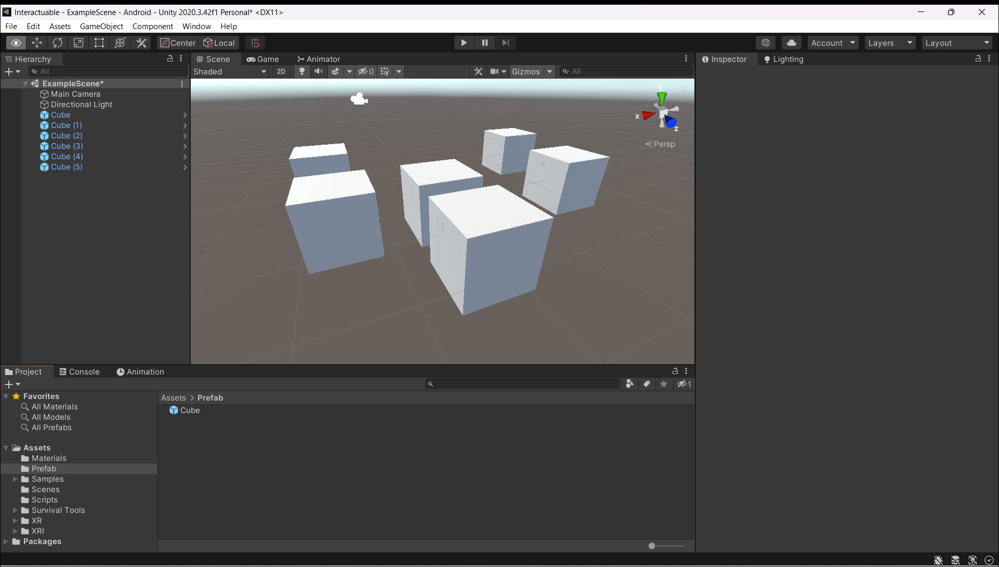

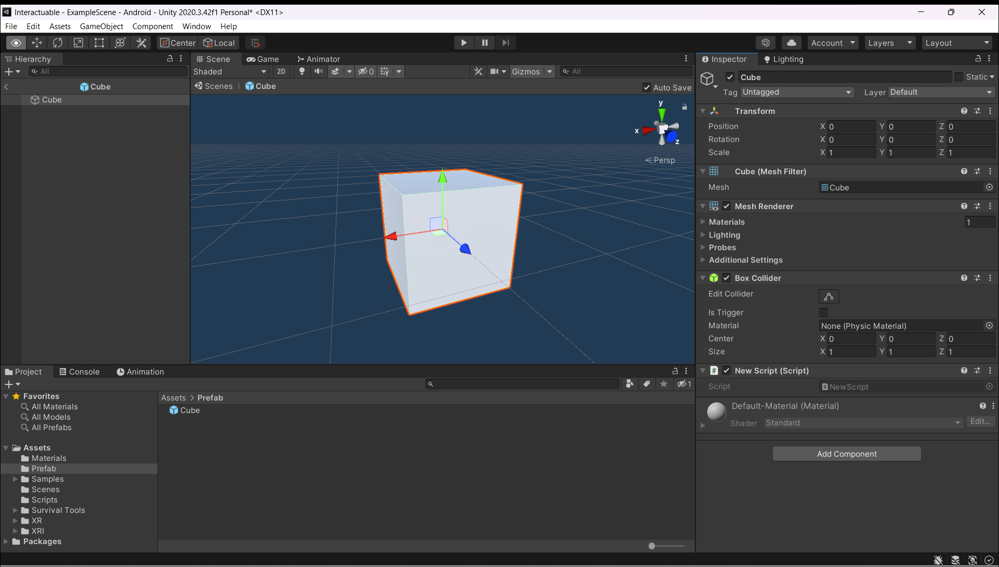

 

### Tienda de Assets (Asset Store)

La tienda de Assets de Unity es un mercado donde puedes comprar y descargar Assets prediseñados, como modelos 3D, efectos de sonido y guiones, para usarlos en tu juego. La Tienda de activos también proporciona una gran cantidad de recursos, incluidos tutoriales y proyectos de muestra, para ayudarte a aprender y desarrollar tus habilidades.

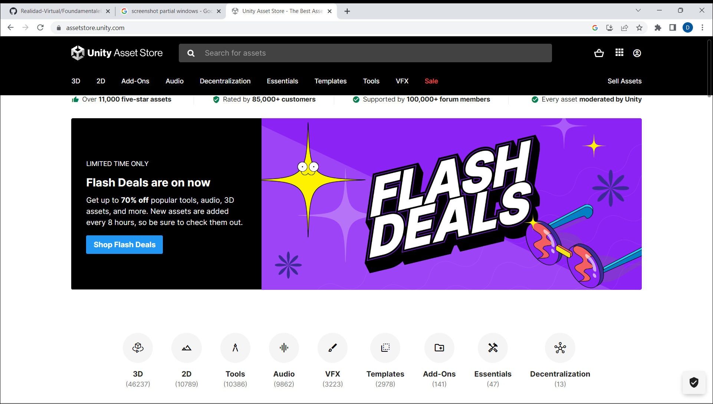

 

### Despliegue (Deployment)

Una vez completado tu juego o aplicación de realidad virtual, puede implementarlo en varias plataformas, como dispositivos de escritorio, móviles y de realidad virtual. Unity proporciona soporte integrado para la implementación en múltiples plataformas, lo que facilita la distribución de tu juego a una amplia audiencia.

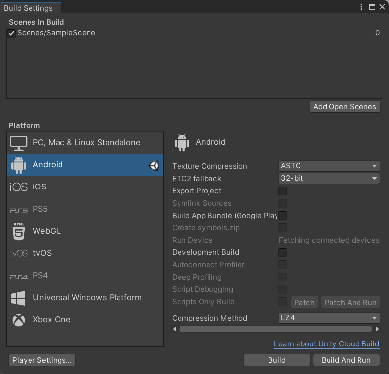

 

### Resumen

En resumen, "Unity Editor" proporciona un entorno de desarrollo potente y flexible para crear juegos y aplicaciones de realidad virtual. Con su interfaz intuitiva, potentes capacidades de secuencias de comandos y soporte integrado para el desarrollo de realidad virtual, Unity es una excelente opción para cualquiera que busque desarrollar juegos y experiencias de realidad virtual de alta calidad.

