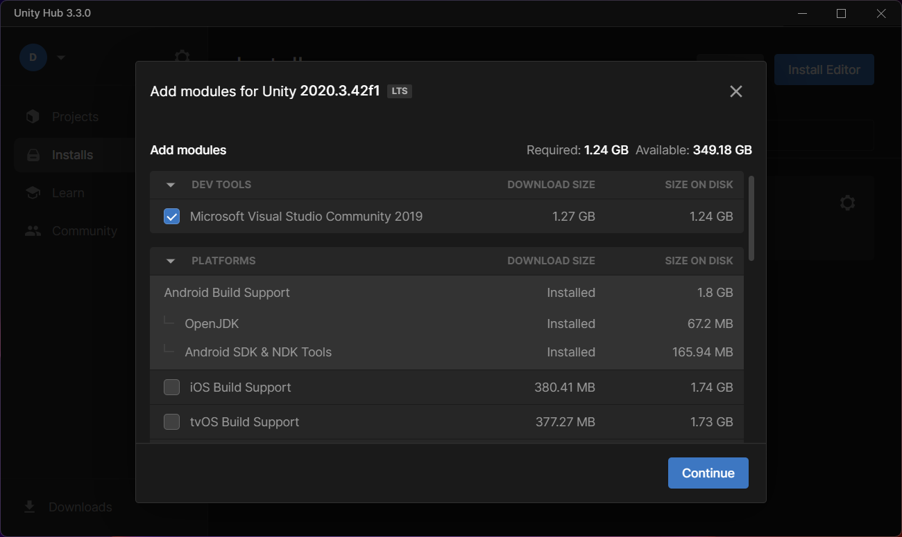

# Unity

## What is Unity?

 
 

* Unity is a popular game engine used for creating video games, simulations, and virtual reality experiences. It provides a powerful suite of tools for developing and deploying immersive VR applications across multiple platforms. With Unity, developers can create realistic environments, characters, and interactions using a wide range of pre-built assets, scripting tools, and visual editors. Additionally, Unity offers extensive support for VR hardware, making it easier for developers to build and test VR applications on a variety of devices. Overall, Unity is an essential tool for creating high-quality, engaging VR experiences.

 
 

## Downloading Unity

 
 

Go to the Unity website <a href="https://unity.com/" target="_blank">Unity</a> 

 

 

Click on the "Get started" button located at the top right corner of the website

 

 

Click on the "Download Unity" button

 

 

On the "Download Unity Hub" page, click on the "Download Unity Hub" button for your operating system (Windows or Mac) 

 

 

Once the Unity Hub installer has downloaded, run it and follow the instructions to install Unity Hub on your computer 

 

 

 After the installation process is complete, launch Unity Hub 

In the Unity Hub window, click on the "Installs" tab located on the left-hand side of the window 

 

 

Click on the "Add" button located at the top right corner of the window

 

 

Select the version of Unity you want to install by clicking on the "Unity 2020 LTS" option

 

 

Select the "Android Build Support" option by clicking on the checkbox next to it

 

* Click the "Next" button and follow the prompts to complete the installation process

* Once the installation process is complete, go back to the Unity Hub window and click on the "Projects" tab located on the left-hand side of the window 

* Click on the "New" button located at the top right corner of the window
* Select the "3D" or "2D" option, depending on your preference, and choose a name and location for your new project
* Click on the "Create" button to create the new project

 
 
 

## Comprender el Editor de Unity

 
 

Unity Editor is a powerful integrated development environment (IDE) that allows game developers to create, design, and deploy games across multiple platforms, including VR (Virtual Reality) platforms. Here is a detailed description of the basic concepts and features of the Unity Editor, with a particular emphasis on VR development.

 

The Unity Interface: The Unity interface is the main workspace where you can access all the tools and features of the editor. The interface consists of various windows, including the Scene View, Game View, Hierarchy, Inspector, Project, and Console. These windows can be rearranged and customized to suit your needs.

 

Scenes: A scene in Unity is a collection of game objects, lights, cameras, and other components that make up a level or area of your game. You can create and manage multiple scenes within a single project.

 

Game Objects: A game object is the basic unit of a scene in Unity. It represents any object in your game, such as a character, a weapon, or an environment asset. Game objects can be customized by adding components, such as colliders, scripts, and particle systems.

 

Components: Components are reusable pieces of code that you can attach to game objects to add functionality. Some examples of components include Rigidbody, Collider, Audio Source, and VR Camera. Components can be created and customized using C#.

 

Scripts: Scripts are written in C# or JavaScript and provide the logic and behavior for game objects. Scripts can be attached to game objects as components, and they can interact with other components and objects in the scene.

 

Prefabs: A prefab is a reusable game object that can be instantiated multiple times in a scene or across different scenes. Prefabs can be created by selecting a game object and dragging it into the project window.

 

VR Development: Unity provides built-in support for developing VR applications, including support for major VR platforms like Oculus Rift, HTC Vive, and Google Cardboard. To develop a VR application, you will need to use specialized components, such as the VR Camera, which is used to render the scene from the player's point of view, and the VR Input, which is used to handle input from VR controllers.

 

Asset Store: The Unity Asset Store is a marketplace where you can buy and download pre-built assets, such as 3D models, sound effects, and scripts, to use in your game. The Asset Store also provides a wealth of resources, including tutorials and sample projects, to help you learn and develop your skills.

 

Deployment: Once you have completed your game or VR application, you can deploy it to various platforms, such as desktop, mobile, and VR devices. Unity provides built-in support for deployment to multiple platforms, making it easy to distribute your game to a wide audience.

 

In summary, the Unity Editor provides a powerful and flexible development environment for creating games and VR applications. With its intuitive interface, powerful scripting capabilities, and built-in support for VR development, Unity is an excellent choice for anyone looking to develop high-quality games and VR experiences.
