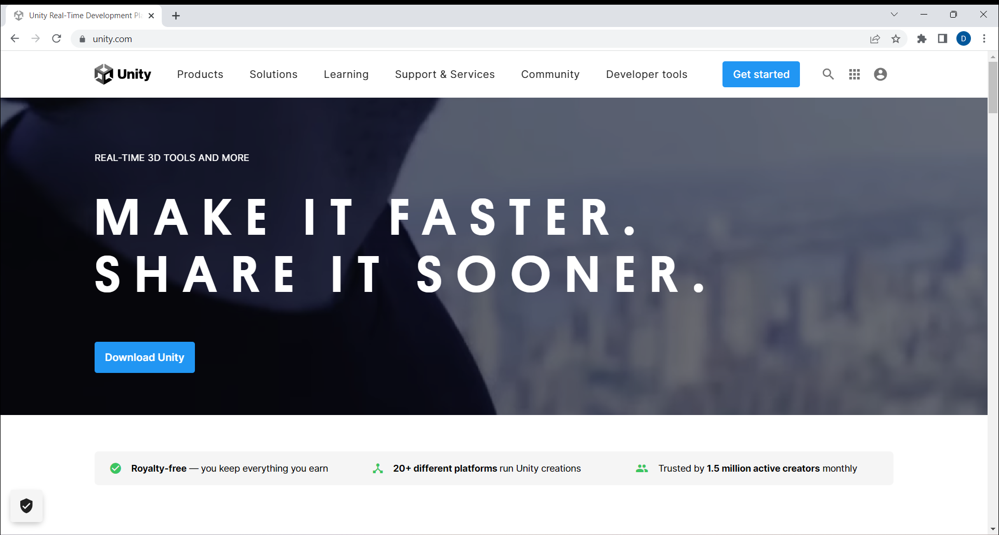
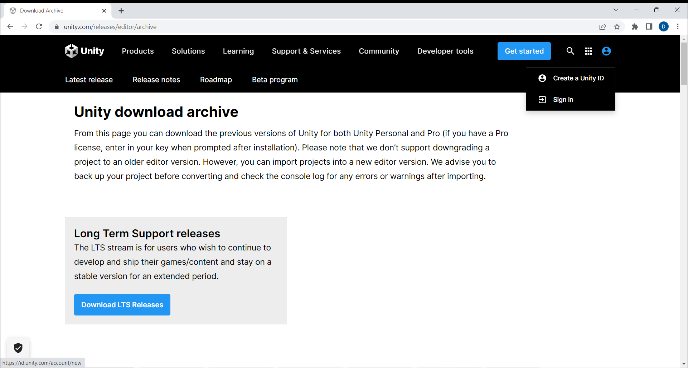
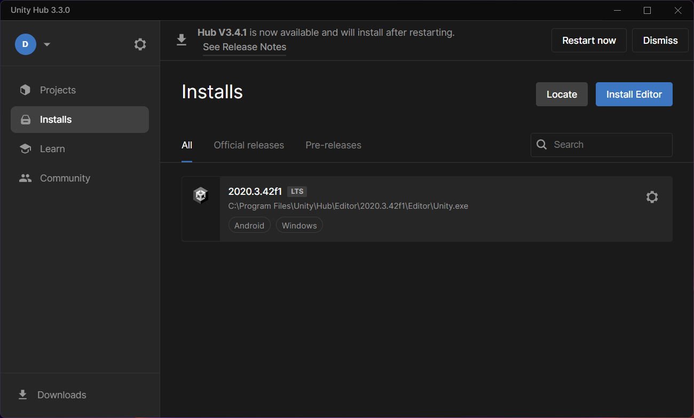
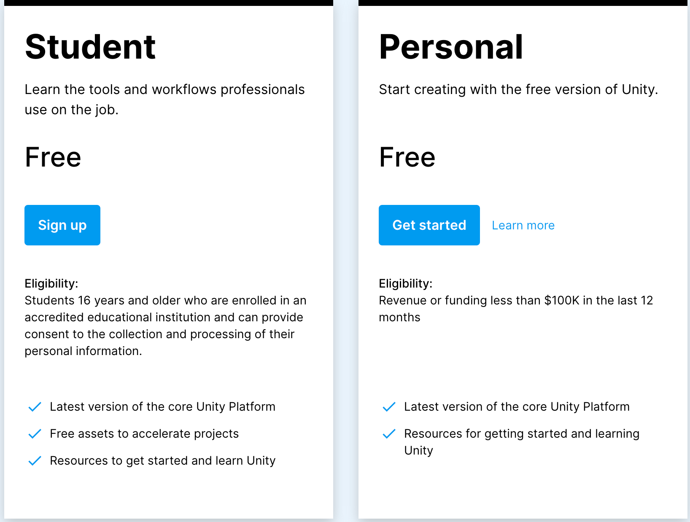
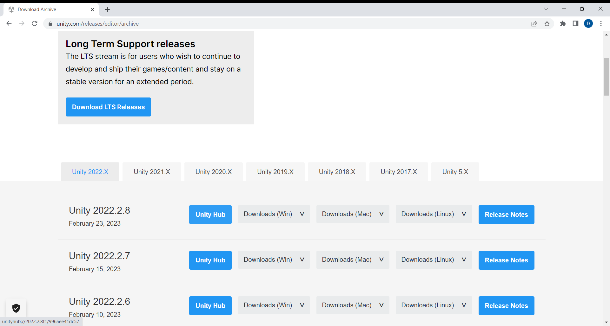
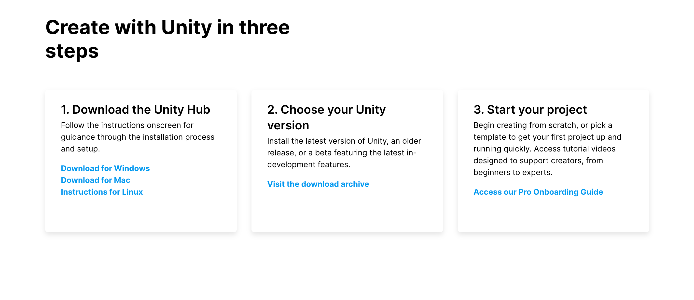
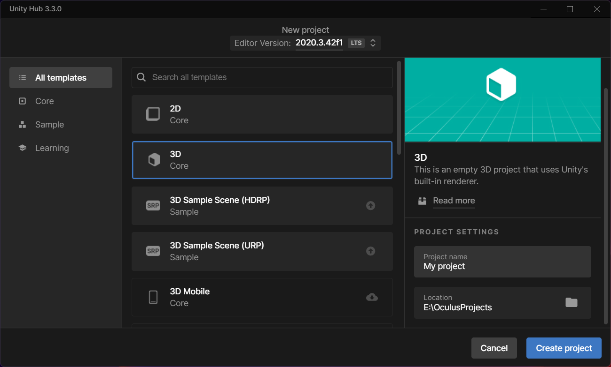
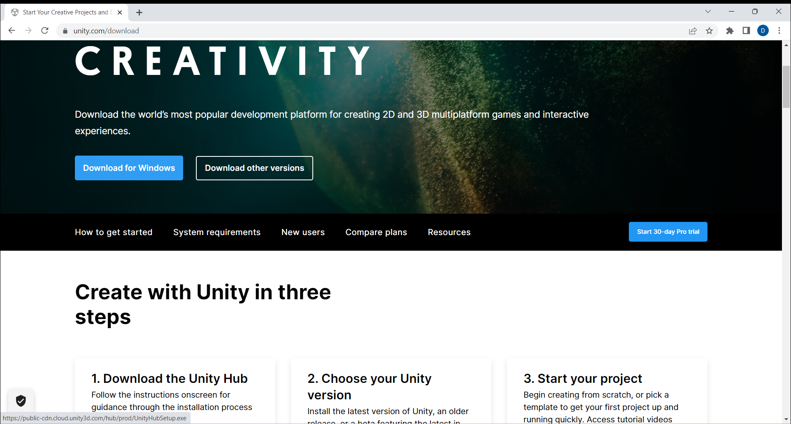
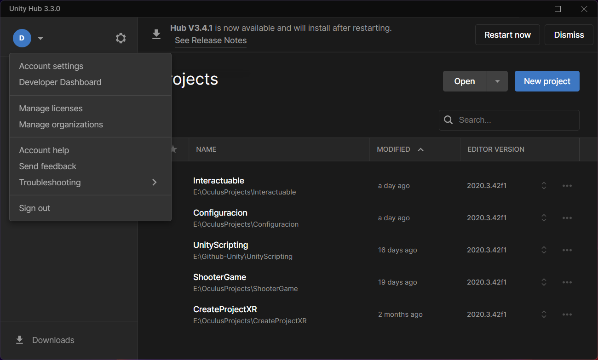
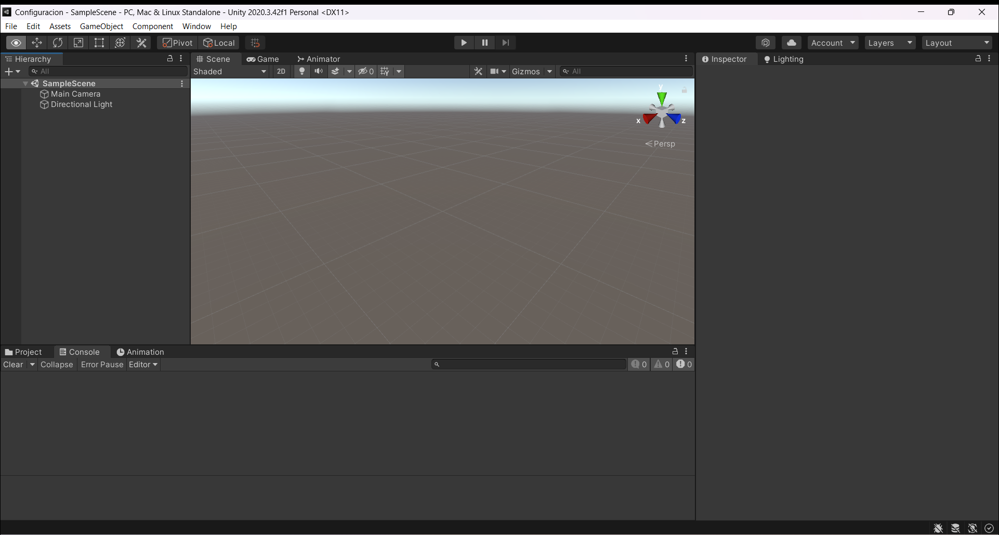

# Enteniendo Unity

## Descripción General

* Go to the Unity website <a href="https://unity.com/" target="_blank">Unity</a>

* Unity is a popular game engine used for creating video games, simulations, and virtual reality experiences. It provides a powerful suite of tools for developing and deploying immersive VR applications across multiple platforms. With Unity, developers can create realistic environments, characters, and interactions using a wide range of pre-built assets, scripting tools, and visual editors. Additionally, Unity offers extensive support for VR hardware, making it easier for developers to build and test VR applications on a variety of devices. Overall, Unity is an essential tool for creating high-quality, engaging VR experiences.

 

* Individual tab use the free personal version allow to publish your game for free

 

* Download the Unity hub <a href="https://unity.com/download" target="_blank">Unity Hub</a> allows to have different versions of Unity, always keep up with the newest versions of Unity Click on Add and choose the Unity 2020 Long term verison support, should still be stable for creating VR project

 

* <a href="https://support.unity.com/hc/en-us/articles/211438683-How-do-I-activate-my-license-" target="_blank">Activate Unity License</a>

* Choose the android toggle SDK, NDK, JDK modules for a proper Android setup

* Oculus Quest is an actual android device that is why
[Image] choose on 3D module for your setup

## Comprender el Editor de Unity

Scene view: Shows your game scene and objects.
Game view: Shows what your game looks like while playing.
Hierarchy: Shows all the objects in your scene.
Project: Shows all the assets in your project.
Inspector: Shows properties and settings for the selected object.
Learn how to create and manage game objects. Game objects are the building blocks of your game, and they can be anything from a player character to a simple cube. To create a new game object, go to the Hierarchy window and click the "Create" button. From here, you can select the type of object you want to create.

Learn how to add components to game objects. Components are what give game objects their functionality. To add a component, select a game object in the Hierarchy window, and then go to the Inspector window. From here, you can add and configure components.

Learn how to move and manipulate game objects in the Scene view. To move an object, select it in the Hierarchy window, and then use the move, rotate, and scale tools in the Scene view.

Learn how to create and manage assets in the Project window. Assets are the files that make up your game, such as textures, models, and audio files. To create a new asset, right-click in the Project window and select "Create". From here, you can select the type of asset you want to create.

Learn how to import assets into your project. To import an asset, simply drag and drop it from your file explorer into the Project window.

Learn how to create and manage scenes. Scenes are the different levels or areas in your game. To create a new scene, go to "File" > "New Scene". From here, you can create and manage your different scenes.

Learn how to build and run your game. To build your game, go to "File" > "Build Settings". From here, you can select the platform you want to build for and configure your build settings. Once you have configured your settings, click "Build" to create your game executable. To run your game, simply double-click the executable file.

